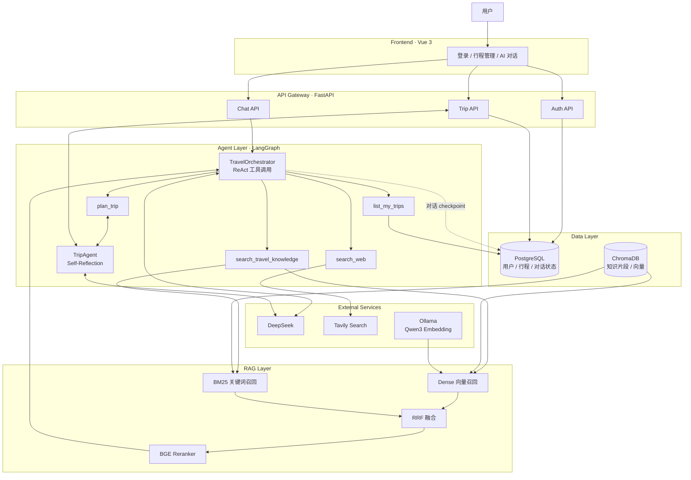
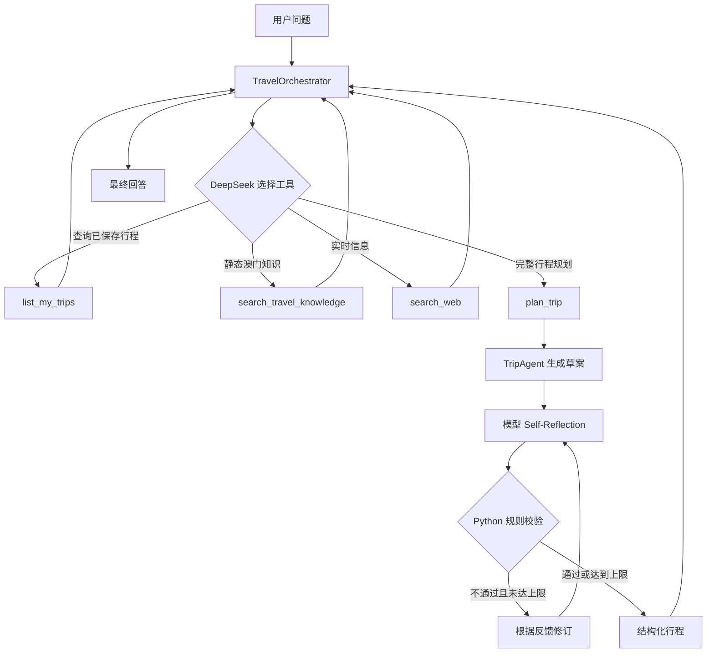
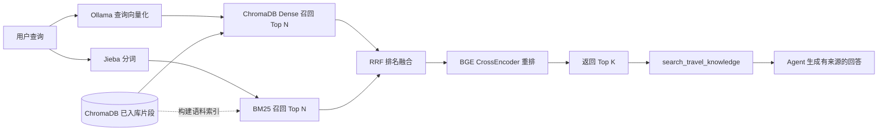

# 澳门旅游智能体

一个聚焦澳门特别行政区的大模型应用开发项目。它不是通用聊天壳，而是把用户账户、行程数据、可追溯知识库、实时网页搜索、Agent 工具调用和 Self-Reflection 行程生成组合成一条完整链路。

## 核心能力

- 邮箱注册、Argon2 密码哈希和 JWT 身份认证。
- 创建、查询、修改和删除澳门行程。
- 基于 LangGraph 工具调用的多轮旅行助手。
- 基于澳门特别行政区政府旅游局公开资料的 RAG 知识库。
- PDF 文本提取及 OCR 回退，支持 Markdown 和 TXT 资料。
- Dense + BM25 + RRF 混合检索，再使用 BGE CrossEncoder 重排。
- DeepSeek 生成行程，然后执行 Self-Reflection 和 Python 确定性质量检查。
- RAG、Agent 回答和行程质量三层评测。

## 系统架构

参考原项目文档的分层方式，当前项目分为前端、API、Agent、RAG、数据和外部服务六层。下图只保留本项目已经实现的组件。



### Agent 编排流程



Agent 层包含两种不同范式：

- `TravelOrchestrator`：LangGraph 的工具调用循环，根据问题决定调用哪个工具。
- `TripAgent`：Self-Reflection，先生成草案，再反思，不合格时进行有上限的修订。Python 负责活动数量、日期和费用等可确定规则，避免仅依赖模型自评。

### RAG 检索流程



## 技术栈

- 后端：Python 3.11、FastAPI、Pydantic、SQLAlchemy Async、Alembic
- Agent：DeepSeek、LangChain、LangGraph、PostgreSQL Checkpointer
- RAG：Ollama `qwen3-embedding:4b`、ChromaDB、Jieba、BM25、RRF、`BAAI/bge-reranker-v2-m3`
- 文档解析：PyPDF、PyMuPDF、RapidOCR
- 实时搜索：Tavily
- 前端：Vue 3、TypeScript、Vite、Pinia、Element Plus

## 项目结构

```text
Travel Agent/
├── backend/
│   ├── app/
│   │   ├── agents/       # Orchestrator 与 Self-Reflection 行程 Agent
│   │   ├── api/          # 认证、行程、聊天 API
│   │   ├── db/           # 异步数据库会话
│   │   ├── models/       # User 和 Trip 数据模型
│   │   └── rag/          # 文档加载、分块、检索、重排
│   ├── data/knowledge/        # 可追溯的 PDF/Markdown 知识资料
│   ├── eval/                  # 三层评测集和评测脚本
│   ├── migrations/            # Alembic 数据库迁移
│   └── knowledge_manifest.json
├── frontend/                       # Vue 管理界面
└── compose.yaml                    # PostgreSQL 和 ChromaDB
```

## 本地启动

### 1. 准备环境

需要 Python 3.11、Node.js、Docker、Git 和 [Ollama](https://ollama.com/)。

```bash
docker compose up -d postgres chromadb
ollama pull qwen3-embedding:4b
```

### 2. 安装后端

```bash
cd backend
python3 -m venv .venv
source .venv/bin/activate
python3 -m pip install -e ".[dev]"
cp .env.example .env
```

在 `backend/.env` 中至少填写：

```dotenv
TRAVEL_AGENT_JWT_SECRET_KEY=一个随机长字符串
TRAVEL_AGENT_DEEPSEEK_API_KEY=你的_DeepSeek_API_Key
TRAVEL_AGENT_TAVILY_API_KEY=你的_Tavily_API_Key
```

可以用下面的命令生成 JWT 密钥：

```bash
python3 -c "import secrets; print(secrets.token_urlsafe(48))"
```

### 3. 初始化数据库和知识库

```bash
alembic upgrade head
python3 -m app.rag.rag_service
```

第二条命令会扫描 `data/knowledge/`，按 `knowledge_manifest.json` 读取资料，执行解析、OCR、分块、去重、向量化和入库。首次启动 API 时会自动初始化 LangGraph checkpoint 表。

### 4. 启动前后端

后端：

```bash
uvicorn app.main:app --reload
```

前端：

```bash
cd ../frontend
npm ci
npm run dev
```

打开 `http://127.0.0.1:5173`。API 文档位于 `http://127.0.0.1:8000/docs`。

## API 概览

| 方法 | 路径 | 用途 |
| --- | --- | --- |
| GET | `/api/v1/health` | 健康检查 |
| POST | `/api/v1/auth/register` | 注册 |
| POST | `/api/v1/auth/login` | 登录并获取 JWT |
| GET | `/api/v1/auth/me` | 获取当前用户 |
| GET/POST | `/api/v1/trips` | 查询或创建行程 |
| GET/PATCH/DELETE | `/api/v1/trips/{trip_id}` | 行程详情、更新和删除 |
| POST | `/api/v1/trips/{trip_id}/generate-plan` | 生成并保存结构化行程 |
| POST | `/api/v1/chat` | 多轮 Agent 问答 |

## 知识库与数据来源

当前知识库由 14 份澳门主题资料组成，涵盖综合指南、世界遗产、博物馆、社区步行、美食、交通、口岸、入境、住宿、无障碍和安全信息。资料标题、发布机构、原始 URL 和获取日期记录在 `backend/knowledge_manifest.json`。

静态知识由本地知识库回答；开放时间、票价、天气等可变信息由 Tavily 实时搜索，避免把易过期内容固化在向量库中。

## 测试与评测

单元测试与代码检查：

```bash
cd backend
pytest -q
ruff check app tests eval
```

RAG 评测：

```bash
python3 -m eval.run_rag_eval --mode dense
python3 -m eval.run_rag_eval --mode hybrid
python3 -m eval.run_rag_eval --mode rerank
```

Agent 和行程评测不会自动登录。先手动登录并设置临时令牌，再运行：

```bash
export TRAVEL_AGENT_EVAL_TOKEN="你登录后获得的_access_token"
python3 -m eval.run_agent_eval
python3 -m eval.run_plan_eval
```

当前本地基线：

| 评测层 | 用例 | Hit@1 | Hit@3 | Hit@5 | MRR@5 |
| --- | ---: | ---: | ---: | ---: | ---: |
| RAG Dense | 33 | 72.73% | 96.97% | 100.00% | 0.8545 |
| RAG Hybrid（Dense + BM25 + RRF） | 33 | 84.85% | 100.00% | 100.00% | 0.9242 |
| RAG Rerank（Hybrid + BGE） | 33 | 93.94% | 100.00% | 100.00% | 0.9697 |

重排将 5 个 Hybrid 排名第 2 的用例提升到第 1，但也把 2 个原本排名第 1 的用例降到第 2，净增加 3 个 Hit@1。

其他评测：Agent 回答最近一次完整评测为 4/4 通过；行程质量评测包含 3 个用例。由于行程生成具有随机性，发布结果时应使用当前模型配置重新运行并注明评测时间。

## 已知边界

- 项目只服务澳门，不是全国或全球旅游助手。
- 票价、开放时间、酒店和餐厅信息可能变动，必须以实时网页资料为准。
- 本地 BGE 重排器的首次加载和推理较慢，生产环境可改用 GPU 或独立推理服务。
- Agent 回答具有随机性；项目使用结构化输出、确定性规则和有界重试降低失败概率。
